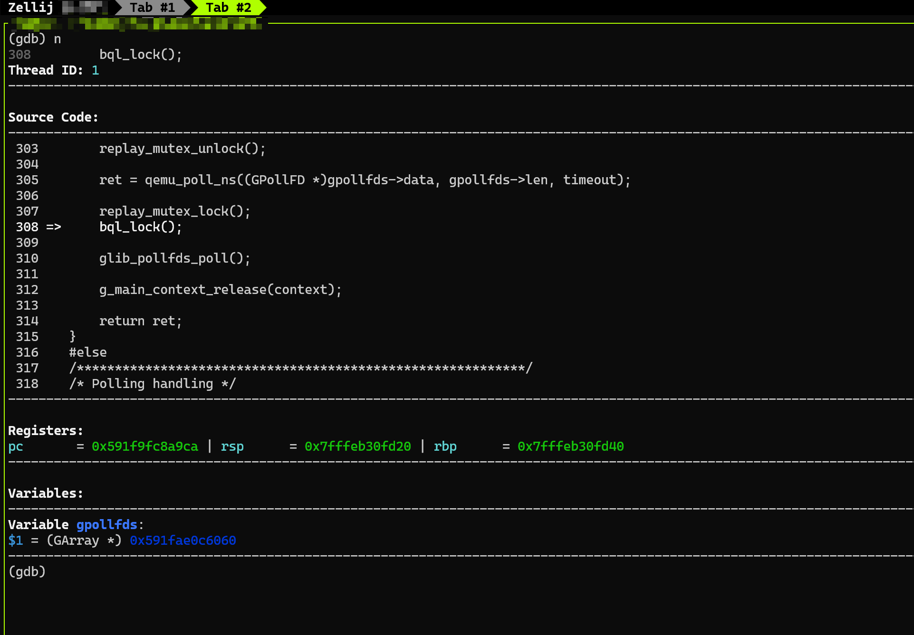

# Custom GDB Hook Script

Automatically print debug information when gdb command stops.

Debug Information including:

- Registers value
- variables value
- Memory block value
- Custom gdb command

## Usage

In gdb
```
(gdb) source <path_to_repo>/c_gdb_hook.py
```

Or in command line
```bash
$ gdb -x "<path_to_repo>/c_gdb_hook.py" <file>
```

## Help

```
(gdb) c-help
GDB Custom Debug Info Commands Help
==================================================

Debug Information Management
--------------------
Register Management:
  c-add-register <reg>    - Add register to display list
  c-rm-register <reg>     - Remove register from display list

Variable Management:
  c-add-variable <var>    - Add variable to display list
  c-rm-variable <var>     - Remove variable from display list

Memory Management:
  c-add-memory <addr> <size>    - Add memory block to track
  c-rm-memory <addr>            - Remove memory block by start address

Command Management:
  c-add-command <cmd>     - Add GDB command to display list
  c-rm-command <index>    - Remove command by its index

Display Control
--------------------
Display Toggle Commands:
  c-toggle-*  - Toggle [thread,registers,backtrace,assembly,source,variable,memory,commands] display
Example c-togggle-thread - Toggle thread display
Display Enable/Disable Commands:
  c-enable-*  - Enable [thread,registers,backtrace,assembly,source,variable,memory,commands] display
  c-disable-* - Disable [thread,registers,backtrace,assembly,source,variable,memory,commands] display

Header Information Control:
  c-enable-display-settings - Enable display settings information
  c-disable-display-settings - Disable display settings information
  c-enable-display-order    - Enable display order information
  c-disable-display-order   - Disable display order information

Display Management:
  c-show [clear]     - Show debug information (with optional screen clear)
  c-clear           - Clear the screen
  c-reorder <order> - Change display order (e.g., thread,backtrace,source,registers,variables,memory,assembly,commands)

Current Settings Status
--------------------
Display Settings:
Thread ID: on | Registers: off | Backtrace: off | Assembly: off | Source: off | Variables: off | Memory: off | Commands: off
Display Order:
thread -> backtrace -> memory -> source -> assembly -> registers -> variables -> commands

Help
--------------------
  c-help            - Show this help message

Note: All commands start with 'c-' prefix
```


## Example

